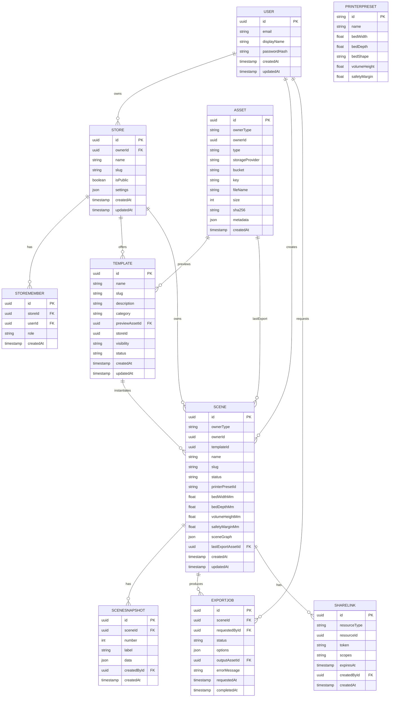

# Backend Studio 3D — Diseño y arquitectura (NestJS)

Este documento define la arquitectura, el modelo de datos y los contratos API del backend para el editor 3D y su evolución hacia un sistema multi‑tenant (SaaS‑ready) con escenas, plantillas (templates) y, a futuro, tienda y pedidos.

La idea central: cada usuario (o tienda) puede crear y gestionar “escenas” independientes, abrirlas en el editor 3D, personalizarlas (figuras, textos, colores, transformaciones), guardarlas y exportarlas a STL.


## Alcance MVP del backend

- Autenticación básica (registro/inicio de sesión con JWT).
- CRUD de escenas del usuario (con opción de basarse en una plantilla).
- Presets de impresoras (cama y volumen) disponibles vía API.
- Subida y gestión mínima de archivos (STL/GLTF/imagen de preview) como “assets”.
- Exportación a STL (disparada por API; inicial: síncrona; futuro: job asíncrono).
- Validación de límites de impresión (usar dimensiones del preset seleccionado).

Futuro cercano (documentado, no obligatorio para MVP): multi‑tenant “Store”, templates públicos/privados, compartir escenas, jobs de exportación asíncronos, pedidos/checkout.


## Arquitectura propuesta

- Framework: NestJS (modular, escalable, probado en prod).
- Base de datos: PostgreSQL (relacional, JSONB para flexibilidad en escenas).
- ORM: Prisma o TypeORM (cualquiera viable; se sugiere Prisma por DX).
- Almacenamiento de archivos: S3 compatible (MinIO en dev; S3 en prod). En dev local se puede usar disco.
- Cache/colas (futuro): Redis + BullMQ para exportaciones y tareas pesadas.
- Autenticación: JWT (Password) en MVP. A futuro, OAuth2/Identity Provider.

Módulos NestJS previstos:
- AuthModule, UsersModule
- StoresModule (multi‑tenant) y StoreMembersModule
- TemplatesModule
- ScenesModule (incluye SceneObjects/SceneSnapshots)
- AssetsModule (subidas y metadata)
- ExportModule (STL)
- PresetsModule (impresoras)
- HealthModule


## Modelo de datos (entidades)

Notas:
- “Escena” es la entidad principal editable en el editor.
- Soportamos tenencia por usuario y por “tienda” (Store). Una escena puede pertenecer a un usuario o a una tienda.
- MVP: guardamos el grafo completo de la escena en JSON (scene_graph). A futuro, podemos normalizar objetos si hace falta.

Entidades clave:

- User
	- id (uuid), email (único), displayName, passwordHash, createdAt, updatedAt

- Store (multi‑tenant; opcional para MVP)
	- id (uuid), ownerId (User), name, slug (único), isPublic, settings (JSON), createdAt, updatedAt

- StoreMember (miembros y roles en una Store)
	- id (uuid), storeId, userId, role ('owner'|'admin'|'editor'|'viewer'), createdAt

- Asset (archivos subidos o generados)
	- id (uuid), ownerType ('user'|'store'|'system'), ownerId, type ('stl'|'gltf'|'image'|'font'|'texture'),
	- storageProvider ('s3'|'local'), bucket, key (ruta en el bucket), fileName, size, sha256, metadata (JSON), createdAt

- Template (plantillas reutilizables)
	- id (uuid), name, slug, description, category, previewAssetId (Asset),
	- sourceSceneSnapshotId (SceneSnapshot) opcional,
	- storeId (si pertenece a una tienda) o null para global,
	- visibility ('private'|'unlisted'|'public'), status ('draft'|'published'), createdAt, updatedAt

- Scene (instancias editables por usuario o tienda)
	- id (uuid), ownerType ('user'|'store'), ownerId,
	- templateId (opcional), name, slug (opcional), status ('draft'|'published'|'archived'),
	- printerPresetId (opcional), bedWidthMm, bedDepthMm, volumeHeightMm, safetyMarginMm (denormalizados para auditar),
	- sceneGraph (JSONB) — estado serializado canónico para el editor,
	- lastExportAssetId (Asset) opcional, createdAt, updatedAt

- SceneSnapshot (versionado/autoguardado)
	- id (uuid), sceneId, number (secuencial), label ('autosave'/'manual'),
	- data (JSONB) — copia del sceneGraph, createdById (User), createdAt

- ExportJob (exportación STL)
	- id (uuid), sceneId, requestedById (User), status ('queued'|'running'|'success'|'error'),
	- options (JSON) — ej: { selectionOnly: false, format: 'stl-binary' },
	- outputAssetId (Asset) opcional, errorMessage (texto), requestedAt, completedAt

- ShareLink (acceso por enlace)
	- id (uuid), resourceType ('scene'|'template'), resourceId, token (único),
	- scopes (string[]) ej: ['view','edit','save-as'], expiresAt (opcional), createdById, createdAt

- PrinterPreset (catálogo)
	- id (string), name, bed: { width, depth, shape: 'rect'|'circle' }, volume: { height }, safetyMargin (mm)

- AuditLog (auditoría/analytics)
	- id (uuid), actorId (User), action (string), resourceType, resourceId, payload (JSON), createdAt


### Diagrama ER (Mermaid)




## Contratos API (MVP)

Autenticación
- POST /auth/register { email, password, displayName }
- POST /auth/login { email, password } → { accessToken }

Presets
- GET /printer-presets → lista de presets (mirror de los de frontend para coherencia)

Escenas
- GET /scenes → lista del usuario autenticado (y/o de su store actual)
- POST /scenes { name, templateId?, printerPresetId?, sceneGraph? } → crea una escena
- GET /scenes/:id → detalle de una escena
- PATCH /scenes/:id { name?, printerPresetId?, sceneGraph? } → update parcial
- DELETE /scenes/:id → archiva/elimina
- POST /scenes/:id/duplicate → clona escena
- POST /scenes/:id/validate → devuelve violaciones de límites de impresión
- POST /scenes/:id/export → inicia exportación STL (MVP: síncrona devuelve archivo o assetId)

Templates
- GET /templates → lista (públicos + del usuario/store)
- GET /templates/:id → detalle
- POST /templates/:id/instantiate → crea una nueva escena desde plantilla

Assets
- POST /assets (multipart/form-data) campo file → crea Asset (tipo deducido por mimetype)
- GET /assets/:id → redirige o firma URL de descarga (si S3)

Export Jobs (si se hace asíncrono)
- GET /export-jobs/:id → ver estado y, cuando esté, link al asset exportado


### DTOs de ejemplo

SceneDTO (lectura):
```json
{
	"id": "e3e3f2f8-...",
	"name": "Carcasa iPhone – Juan",
	"owner": { "type": "user", "id": "..." },
	"templateId": "8c61-...",
	"status": "draft",
	"printerPresetId": "ender3-v2",
	"bed": { "width": 220, "depth": 220, "shape": "rect" },
	"volume": { "height": 250 },
	"sceneGraph": {
		"version": 1,
		"objects": [
			{
				"id": "obj-1",
				"type": "primitive",
				"kind": "box",
				"transform": { "position": [0, 5, 0], "rotation": [0, 0, 0], "scale": [20, 10, 2] },
				"material": { "color": "#ff5533", "metalness": 0, "roughness": 1 },
				"metadata": { "name": "base" }
			},
			{
				"id": "obj-2",
				"type": "text",
				"text": { "value": "JUAN", "fontAssetId": "font-123", "size": 8, "depth": 2 },
				"transform": { "position": [0, 6, 0], "rotation": [0, 0, 0], "scale": [1, 1, 1] },
				"material": { "color": "#222222" }
			},
			{
				"id": "obj-3",
				"type": "mesh",
				"mesh": { "assetId": "asset-456", "centered": true },
				"transform": { "position": [10, 4, 0], "rotation": [0, 0.4, 0], "scale": [1, 1, 1] },
				"material": { "color": "#00aaff" }
			}
		]
	},
	"lastExportAssetId": null,
	"createdAt": "2025-10-27T12:00:00.000Z",
	"updatedAt": "2025-10-27T12:10:00.000Z"
}
```

Respuesta de validación de límites:
```json
{
	"ok": false,
	"violations": [
		{ "type": "bounds", "objectId": "obj-3", "message": "Se sale del área de la cama (X+)" }
	]
}
```


## Persistencia: JSON vs normalización

- MVP recomendado: guardar la escena completa en `sceneGraph` (JSONB) + snapshots periódicos.
	- Ventajas: simple, flexible, versionable, evoluciona con el editor sin migrar tablas.
	- Indexar por `id`, `updatedAt`, `ownerType/id`, `templateId` y por `status`.
- Futuro: si necesitas consultas específicas (buscar por tipo, color, etc.), crear tablas derivadas `SceneObject` o vistas materializadas para analítica/búsquedas.


## Multi‑tenancy y seguridad

- Tenencia mixta: `ownerType` + `ownerId` permite escenas de usuario o de tienda.
- Roles de tienda: owner/admin/editor/viewer con ACLs simples.
- JWT en MVP (access token corto + refresh opcional). A futuro, OAuth2/IdP.
- Share links con permisos limitados (view/edit/save‑as) y expiración para flujos de personalización de clientes.
- Rate limiting por IP/usuario en endpoints sensibles (auth, export, upload).


## Almacenamiento de archivos (Assets)

- S3/MinIO recomendado. Estructura de keys sugerida:
	- `users/{userId}/assets/{assetId}/{fileName}`
	- `stores/{storeId}/assets/{assetId}/{fileName}`
- Guardar `sha256` para deduplicación futura.
- Servir por URL firmada (pre‑signed) o CDN según entorno.


## Exportación STL

- MVP: síncrona. POST `/scenes/:id/export` devuelve `application/sla` o `assetId` si se persiste.
- Futuro: job asíncrono con BullMQ. Endpoint para consultar estado y descargar resultado.
- Guardar opciones usadas (binario/ascii, selección completa o parcial) en `ExportJob.options`.


## Validación de límites de impresión

- Backend re‑valida usando cama/volumen denormalizados en `Scene` o leyendo el preset por `printerPresetId`.
- Devuelve lista de violaciones por objeto y tipo (X/Y fuera, Z supera altura, colisiones opcional a futuro).


## Estructura de proyecto (NestJS)

```
studio-server/
	src/
		modules/
			auth/
			users/
			stores/
			store-members/
			templates/
			scenes/
				snapshots/
			assets/
			export/
			presets/
			health/
		common/
			decorators/
			guards/
			interceptors/
			dtos/
		config/
	prisma/ | orm/
	test/
```


## Próximos pasos sugeridos

1) Elegir ORM (Prisma recomendado) y crear esquema inicial con las entidades de MVP (User, Scene, SceneSnapshot, Asset, PrinterPreset).
2) Implementar Auth (JWT) y CRUD básico de Scenes con `sceneGraph` (JSONB) + endpoint de validación.
3) Integrar presets de impresora (semilla inicial desde los del frontend para consistencia).
4) Implementar subida de assets (local en dev, S3 en prod) y endpoint de exportación STL.
5) Preparar `Store` y `Template` para la siguiente iteración (multi‑tenant + publicación de plantillas).


## Notas de interoperabilidad con el frontend (studio-ui)

- `printerPresetId` debe corresponderse con los IDs en `studio-ui/src/core/printers/presets.ts`. También exponerlos por API para no duplicar fuentes.
- El `sceneGraph` debe ser compatible con el estado que maneja el editor (R3F). Versionar el objeto (`sceneGraph.version`).
- Para Undo/Redo, el frontend mantiene su historial. El backend recibe estados consolidados al guardar y crea `SceneSnapshot` si procede.